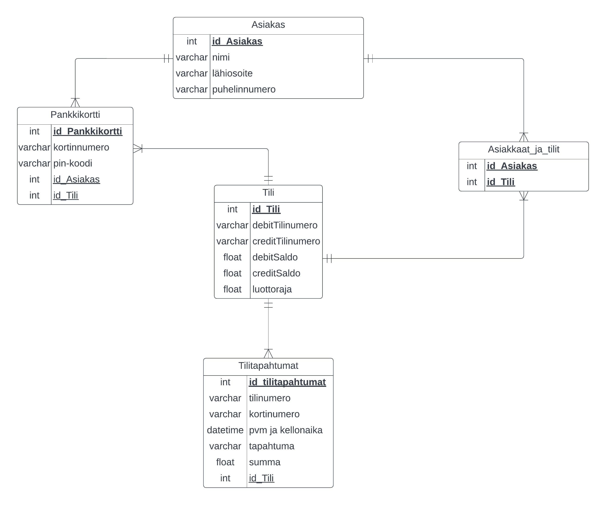

# Spring 2022 school group project 
## Project name: Bankautomat
### Primary idea:
Projects idea was to create a mockup of Bankautomat (ATM). User could withdraw/deposit money and also browse their account transactions. User has debit account, but credit account can also be added to their card. Debit and credit accounts are almost identical, but credit account has a credit limit.

### How it works:
User inserts their debit/credit card to a card reader which then demands user to input correct pincode. If user has only debit account, a main window is shown. If user has both debit and credit account, a screen which asks user to choose desired account is shown.

Demo video (in Finnish): https://www.youtube.com/watch?v=wrGnpeAZ7e4

## Technologies and tools:

### Backend:
Projects backend was created using Node.js and JavaScript. Node.js has npm (a node package manager), which was very useful and we used various packages from its library. Worth mentioning libraries are Express (web application framework), bcrypt (a library to hash passwords), CORS (Cross-Origin Resource Sharing) and mysql (node.js driver for mysql).

### Frontend
TODO

### Database:
We used a relational database and MySQL (an open-source relational database management system) for managing it.

Picture of database ER-diagram:

### Heroku:
Todo

### Architecture and structure
Todo
